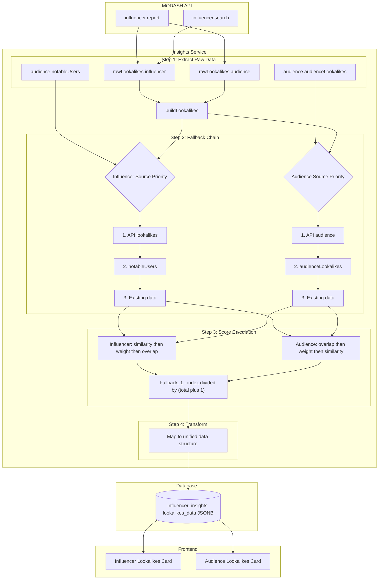

# Influencer Lookalikes - Data Flow & Calculation Logic

## Architecture Overview (ASCII)

```
┌─────────────────────────────────────────────────────────────────────────┐
│                         MODASH API (External)                           │
│  ┌─────────────────────┐    ┌─────────────────────┐                     │
│  │ influencer.report() │    │ influencer.search() │                     │
│  └──────────┬──────────┘    └──────────┬──────────┘                     │
│             │                            │                                │
│  ┌──────────▼──────────┐    ┌──────────▼──────────┐                     │
│  │ lookalikes: {       │    │ lookalikes: []        │                     │
│  │   influencer: [],  │    │ (relevance search)    │                     │
│  │   audience: []      │    │                       │                     │
│  │ }                   │    │                       │                     │
│  └──────────┬──────────┘    └─────────────────────┘                     │
└─────────────┼───────────────────────────────────────────────────────────┘
              │
              ▼
┌─────────────────────────────────────────────────────────────────────────┐
│                      INSIGHTS SERVICE (Backend)                         │
│                                                                         │
│  ┌─────────────────────────────────────────────────────────────────┐   │
│  │                    PROCESSING PIPELINE                          │   │
│  │                                                                 │   │
│  │  ┌─────────────────────────────────────────────────────────┐   │   │
│  │  │ STEP 1: RAW DATA EXTRACTION                            │   │   │
│  │  │                                                         │   │   │
│  │  │  rawLookalikes?.influencer ──┐                         │   │   │
│  │  │  rawLookalikes?.audience ────┼──► buildLookalikes()     │   │   │
│  │  │  audience?.notableUsers ─────┤                         │   │   │
│  │  │  audience?.audienceLookalikes┘                         │   │   │
│  │  └─────────────────────────────────────────────────────────┘   │   │
│  │                            │                                    │   │
│  │                            ▼                                    │   │
│  │  ┌─────────────────────────────────────────────────────────┐   │   │
│  │  │ STEP 2: DATA SOURCE FALLBACK CHAIN                       │   │   │
│  │  │                                                         │   │   │
│  │  │  INFLUENCER LOOKALIKES:                                │   │   │
│  │  │  ┌─────────────────────────────────────────────────┐   │   │   │
│  │  │  │ 1. rawLookalikes.influencer                    │   │   │   │
│  │  │  │      ↓ (if empty)                              │   │   │   │
│  │  │  │ 2. audience.notableUsers                       │   │   │   │
│  │  │  │      ↓ (if empty)                              │   │   │   │
│  │  │  │ 3. existing?.influencer (stored data)          │   │   │   │
│  │  │  └─────────────────────────────────────────────────┘   │   │   │
│  │  │                                                         │   │   │
│  │  │  AUDIENCE LOOKALIKES:                                  │   │   │
│  │  │  ┌─────────────────────────────────────────────────┐   │   │   │
│  │  │  │ 1. rawLookalikes.audience                      │   │   │   │
│  │  │  │      ↓ (if empty)                              │   │   │   │
│  │  │  │ 2. audience.audienceLookalikes                 │   │   │   │
│  │  │  │      ↓ (if empty)                              │   │   │   │
│  │  │  │ 3. existing?.audience (stored data)            │   │   │   │
│  │  │  └─────────────────────────────────────────────────┘   │   │   │
│  │  └─────────────────────────────────────────────────────────┘   │   │
│  │                            │                                    │   │
│  │                            ▼                                    │   │
│  │  ┌─────────────────────────────────────────────────────────┐   │   │
│  │  │ STEP 3: SCORE CALCULATION                              │   │   │
│  │  │                                                         │   │   │
│  │  │  INFLUENCER (Similarity Score):                        │   │   │
│  │  │  ┌────────────────────────────────────────────────┐    │   │   │
│  │  │  │ Priority: similarity → weight → overlap        │    │   │   │
│  │  │  │                                                 │    │   │   │
│  │  │  │ Fallback Formula (if no explicit score):       │    │   │   │
│  │  │  │ score = (1 - index / (total + 1)) * 100 / 100    │    │   │   │
│  │  │  │                                                 │    │   │   │
│  │  │  │ Example: 5 items → [0.83, 0.67, 0.50, 0.33, 0.17]│    │   │   │
│  │  │  └────────────────────────────────────────────────┘    │   │   │
│  │  │                                                         │   │   │
│  │  │  AUDIENCE (Overlap Score):                             │   │   │
│  │  │  ┌────────────────────────────────────────────────┐    │   │   │
│  │  │  │ Priority: overlap → weight → similarity        │    │   │   │
│  │  │  │                                                 │    │   │   │
│  │  │  │ Same fallback formula applies                   │    │   │   │
│  │  │  └────────────────────────────────────────────────┘    │   │   │
│  │  └─────────────────────────────────────────────────────────┘   │   │
│  │                            │                                    │   │
│  │                            ▼                                    │   │
│  │  ┌─────────────────────────────────────────────────────────┐   │   │
│  │  │ STEP 4: DATA TRANSFORMATION                              │   │   │
│  │  │                                                         │   │   │
│  │  │  mapInfluencer(item, index, total):                     │   │   │
│  │  │  ┌────────────────────────────────────────────────┐    │   │   │
│  │  │  │ {                                               │    │   │   │
│  │  │  │   username: item.username,                      │    │   │   │
│  │  │  │   fullName: item.fullname/fullName/full_name,   │    │   │   │
│  │  │  │   followers: item.followers,                    │    │   │   │
│  │  │  │   similarity: calculated_score,                 │    │   │   │
│  │  │  │   profilePictureUrl: picture/avatar            │    │   │   │
│  │  │  │ }                                               │    │   │   │
│  │  │  └────────────────────────────────────────────────┘    │   │   │
│  │  │                                                         │   │   │
│  │  │  mapAudience(item, index, total):                      │   │   │
│  │  │  ┌────────────────────────────────────────────────┐    │   │   │
│  │  │  │ {                                               │    │   │   │
│  │  │  │   username: item.username,                      │    │   │   │
│  │  │  │   fullName: item.fullname/fullName/full_name,   │    │   │   │
│  │  │  │   followers: item.followers,                    │    │   │   │
│  │  │  │   overlap: calculated_score,                    │    │   │   │
│  │  │  │   profilePictureUrl: picture/avatar            │    │   │   │
│  │  │  │ }                                               │    │   │   │
│  │  │  └────────────────────────────────────────────────┘    │   │   │
│  │  └─────────────────────────────────────────────────────────┘   │   │
│  │                            │                                    │   │
│  └────────────────────────────┼────────────────────────────────────┘   │
│                             │                                         │
└─────────────────────────────┼─────────────────────────────────────────┘
                              │
                              ▼
┌─────────────────────────────────────────────────────────────────────────┐
│                         DATABASE STORAGE                                │
│                                                                         │
│  ┌─────────────────────────────────────────────────────────────────┐   │
│  │           influencer_insights Table                               │   │
│  │                                                                 │   │
│  │  lookalikes_data (JSONB):                                       │   │
│  │  ┌─────────────────────────────────────────────────────────┐   │   │
│  │  │ {                                                        │   │   │
│  │  │   "influencer": [                                         │   │   │
│  │  │     { username, fullName, followers, similarity,           │   │   │
│  │  │       profilePictureUrl },                                │   │   │
│  │  │     ... (up to N items)                                   │   │   │
│  │  │   ],                                                      │   │   │
│  │  │   "audience": [                                           │   │   │
│  │  │     { username, fullName, followers, overlap,             │   │   │
│  │  │       profilePictureUrl },                                │   │   │
│  │  │     ... (up to N items)                                   │   │   │
│  │  │   ]                                                       │   │   │
│  │  │ }                                                        │   │   │
│  │  └─────────────────────────────────────────────────────────┘   │   │
│  │                                                                 │   │
│  └─────────────────────────────────────────────────────────────────┘   │
│                                                                         │
└─────────────────────────────────────────────────────────────────────────┘
                              │
                              ▼
┌─────────────────────────────────────────────────────────────────────────┐
│                      FRONTEND DISPLAY                                   │
│                                                                         │
│  ┌─────────────────────┐    ┌─────────────────────┐                    │
│  │ Influencer          │    │ Audience            │                    │
│  │ Lookalikes          │    │ Lookalikes          │                    │
│  │ (Content Similarity)│    │ (Audience Overlap)  │                    │
│  │                     │    │                     │                    │
│  │ • @alex_style       │    │ • @taylor_buzz      │                    │
│  │   Similarity: 92%   │    │   Overlap: 45%      │                    │
│  │                     │    │                     │                    │
│  │ • @jordan_arts      │    │ • @morgan_vibe      │                    │
│  │   Similarity: 87%   │    │   Overlap: 38%      │                    │
│  │                     │    │                     │                    │
│  │ • @sam_lifestyle    │    │ • @quinn_wave       │                    │
│  │   Similarity: 83%   │    │   Overlap: 32%      │                    │
│  └─────────────────────┘    └─────────────────────┘                    │
│                                                                         │
└─────────────────────────────────────────────────────────────────────────┘
```

## Mermaid Flowchart (Fixed)



## Score Calculation Examples

| Position | Total Items | Calculated Score |
|----------|-------------|------------------|
| 1st | 5 | 0.83 (83%) |
| 2nd | 5 | 0.67 (67%) |
| 3rd | 5 | 0.50 (50%) |
| 4th | 5 | 0.33 (33%) |
| 5th | 5 | 0.17 (17%) |

## Key Differences

| Feature | Influencer Lookalikes | Audience Lookalikes |
|---------|----------------------|---------------------|
| **Basis** | Content similarity | Audience overlap |
| **Score Field** | `similarity` | `overlap` |
| **Source Priority** | API → notableUsers → existing | API → audienceLookalikes → existing |
| **API Endpoint** | `influencer.report` | `influencer.report` |
| **Discovery Search** | `relevance` param | `audienceRelevance` param |

## Code Reference

The main logic is in `src/modules/insights/insights.service.ts`:

- `buildLookalikes()` - Lines 1555-1601
- `normalizeLookalikes()` - Lines 1546-1553
- `generateMockLookalikes()` - Lines 931-948
